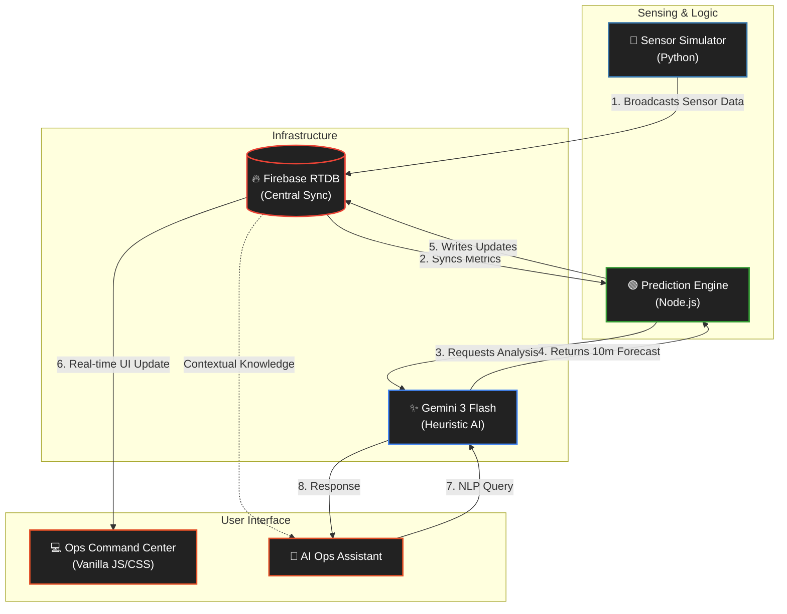

<div align="center">
  <h1>NexGate</h1>
  <p><strong>AI-Powered Stadium Crowd Analytics & Logistics Monitoring</strong></p>
  
  <p>
    
    
    
    
  </p>
</div>

## 📌 Project Overview
NexGate is a comprehensive stadium operations platform designed to enhance attendee safety and optimize venue logistics. By integrating live sensor data with advanced AI forecasting, NexGate allows event staff to identify crowd surges and congestion points before they reach critical levels.

## 🚀 Key Capabilities

*   **⚡ Predictive Risk Analysis:** Utilizes Gemini 3 Flash to analyze real-time density trends and provide 10-minute risk forecasts for every zone in the stadium.
*   **🔄 Real-time Operations Sync:** Powered by Firebase Realtime Database, providing sub-second synchronization between backend sensors and situational awareness dashboards.
*   **🔋 Efficient Resource Management:** Implements an "Active Heartbeat" protocol to dynamically scale backend intensity based on user engagement, optimizing cloud resource consumption.
*   **🍔 Concession Load Balancing:** Real-time monitoring of food and beverage wait times to redirect traffic and minimize attendee queues.
*   **♿ Accessible Operations Dashboard:** Built with inclusive design principles, featuring high-contrast skeuomorphic UI and full screen-reader support via semantic ARIA implementation.

## 🧠 System Architecture

NexGate uses a reactive message-bus architecture to decouple physical sensors from the AI reasoning engine.



## 🛠️ Quick Start

**1. Configuration**
Add your Firebase Project ID, Database URL, and Gemini API Key to a `.env` file in the root directory.

**2. Simulation**
Initialize the sensor network simulator:
```bash
cd simulator
python simulator.py
```

**3. AI Analysis**
Boot the prediction engine:
```bash
cd engine
npm install
npm start
```

**4. Dashboard**
Serve the web interface to view the live stadium matrix:
```bash
cd dashboard
npx serve . -l 3456
```
Open `http://localhost:3456` in your browser.