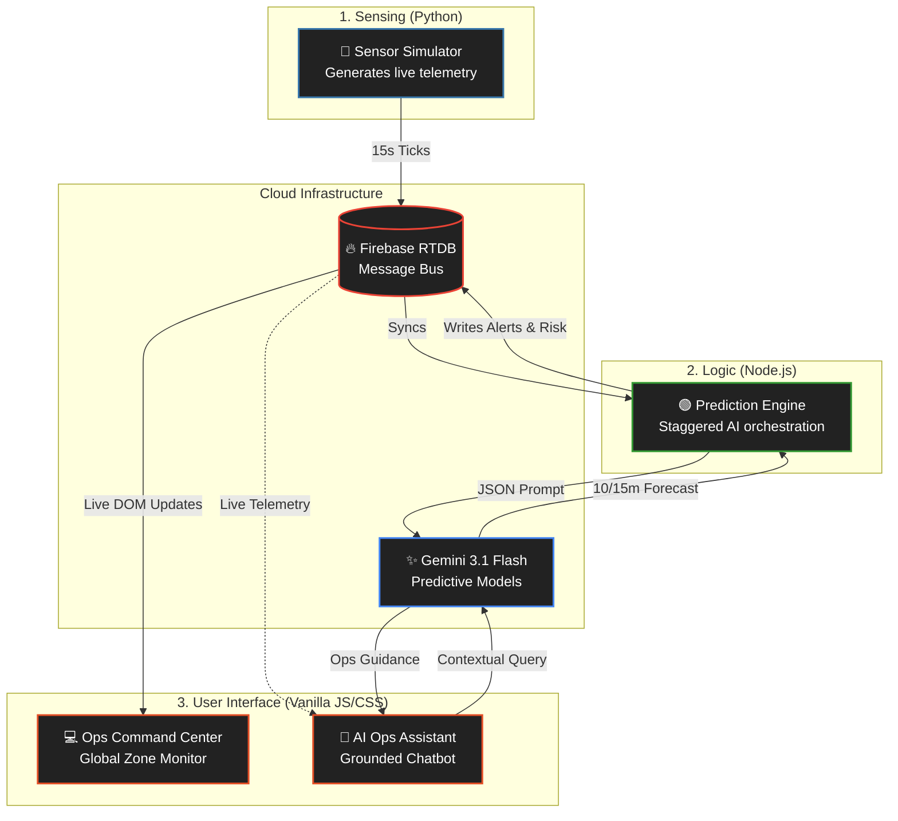

<div align="center">
  <h1>🏟️ NexGate</h1>
  <p><strong>AI-Powered Stadium Crowd Analytics & Logistics Monitoring</strong></p>
  
  <p>
    
    
    
    
    
  </p>
</div>

## 📌 Project Overview
**NexGate** is an advanced operational intelligence platform designed for large-scale sporting and entertainment venues (e.g., 60,000-seat stadiums). Rather than simply reacting to crowd congestion, NexGate uses **predictive AI** to forecast bottlenecks *before* they happen.

By integrating continuous sensor telemetry with Google's latest **Gemini 3.1 Flash Lite**, NexGate empowers venue staff to make proactive decisions—such as redirecting foot traffic, opening overflow lanes, and managing concession surges—ensuring both operational efficiency and attendee safety.

---

## 🚀 Key Innovations & Capabilities

### ⚡ 1. Predictive Risk Analysis (Gemini 3.1)
The backend engine aggregates historical and live sensor data across 8 distinct stadium zones. It queries Gemini every ~60 seconds via a staggered event-loop to predict density and queue lengths **10 to 15 minutes into the future**. If Gemini detects an impending bottleneck (e.g., density > 85%), it automatically generates an actionable directive (e.g., *"Open two additional overflow lanes at Gate North"*).

### 🤖 2. Context-Aware "Ops Intel" Chatbot
Staff have access to a live chat interface built directly into the dashboard. Instead of a generic LLM, the chatbot is injected with the **exact real-time density matrix** and timestamped telemetry of the entire stadium. This creates a grounded, hallucination-resistant assistant that can immediately pull up wait times or generate calm emergency instructions.

### 🔄 3. Sub-Second Real-Time Sync (Firebase)
NexGate uses a reactive message-bus architecture via **Firebase Realtime Database**. This decouples the physical simulated sensors from the AI reasoning engine, meaning the dashboard UI updates with sub-second latency the moment the engine commits a new prediction.

### 🔋 4. Smart "Heartbeat" Resource Management
To optimize cloud costs, the system features an "Active Heartbeat" protocol. If the dashboard is closed or idle for > 15 minutes, the heavy AI Prediction Engine automatically enters a high-efficiency hibernation mode, instantly waking up the moment a staff member reopens the dashboard.

### 🛡️ 5. Resilient Architecture
Built for the chaos of live events, NexGate features robust fault tolerance:
*   **Exponential Backoff:** Gracefully handles transient *503 High Demand* spikes from the Gemini API.
*   **Moving Average Fallback:** If the AI API goes offline completely, the engine seamlessly degrades to a deterministic moving-average model to keep basic metrics flowing.
*   **Zero Hardcoded Secrets:** Employs a secure `.env` → `config.js` pipeline so no API keys are ever exposed in git.

---

## 🧠 System Architecture

NexGate is divided into three distinct, decoupled microservices working in concert:



---

## 🛠️ Local Deployment Guide

Running NexGate locally requires launching all three microservices in separate terminal windows.

### Prerequisites
*   Node.js (v18+)
*   Python (3.9+)
*   A Firebase Realtime Database Instance
*   A Google Gemini API Key

### Step 1: Configuration
1. Rename `.env.example` to `.env` in the root folder.
2. Fill in your Gemini and Firebase credentials.
3. Run the security bridge to expose safe variables to the vanilla JS frontend:
   ```bash
   node setup-config.js
   ```

### Step 2: Boot the Sensor Simulator
The Python script acts as the stadium's IoT network, simulating the flow of foot traffic around events like Kickoff and Halftime.
```bash
cd simulator
pip install -r requirements.txt
python simulator.py
```
> **Tip:** You can set `SIMULATION_SPEED=60` in the `.env` to make 1 minute of simulation happen in 1 second of real-time!

### Step 3: Boot the AI Prediction Engine
The Node.js backend fetches the sensor data, orchestrates requests to the Gemini model with a 15-second stagger (to respect rate limits), and processes alert logic.
```bash
cd engine
npm install
npm start
```

### Step 4: Launch the Ops Dashboard
The frontend uses pure Vanilla Javascript, CSS3 Skeuomorphism, and HTML5 (no React overhead) for maximum raw performance and simplicity.
```bash
cd dashboard
npx serve . -l 3456
```
Navigate to **`http://localhost:3456`** in your browser.

---

## 🎨 UI/UX Design Philosophy
NexGate employs a **Skeuomorphic Dark Mode** aesthetic. 
In high-stress control rooms, flat design can be ambiguous. NexGate uses inset shadows, glassmorphism, and physical depth cues so that input fields look like inputs, buttons look pressable, and critical "SURGE" badges visually pop off the screen. 

---
<div align="center">
  <i>Engineered for the chaos of live events.</i>
</div>